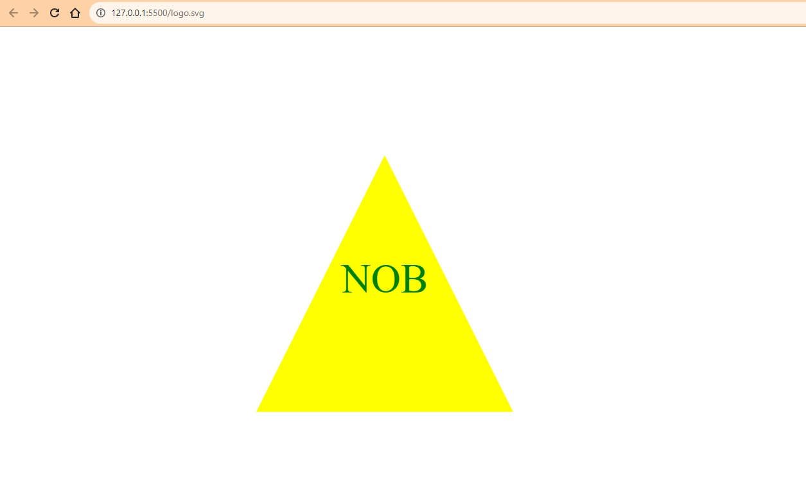

# SVG Logo Maker

## Description

This command-line application is tailor-made for web developers, especially those who need a rapid and efficient method for generating logos for their projects without the necessity of graphic designers. With this tool, logos can be tailored in shape, color, and text and then saved as an SVG file.

- **Motivation**: The life of a freelance web developer often means juggling multiple roles. One of them might occasionally be playing the part of a graphic designer. This project was born out of the necessity to quickly craft simple yet impactful logos for diverse projects without the dependence on external tools or services.
  
- **Why**: Autonomy and speed are the game changers. Why sit around waiting for a graphic designer or wrestle with intricate design software for a straightforward logo requirement? Additionally, a few savings never hurt anybody.
  
- **Problem Solved**: Offers a swift method to generate SVG logos based on direct user input from the command line.

- **Learnings**: Diving deep into node.js, exploring SVG generation, crafting CLI tools, and refining user input to create an intuitive user experience.

## Table of Contents 

- [Installation](#installation)
- [Usage](#usage)
- [Credits](#credits)
- [License](#license)

## Installation

1. Clone the repository to your machine.
2. Navigate to the directory.
3. Execute `npm install` to fetch the necessary dependencies.

## Usage

1. Kickstart the application with the `node index.js` command.
2. Adhere to the on-screen cues to customize your logo's shape, tint, and text.
3. On successful wrap-up, the message "Generated logo.svg" will be displayed. Launch this file in any web browser to admire your freshly minted logo.

Here's a snapshot of a sample SVG:
\```md

\```

### Demo Video
Check out the [SVG Logo Maker Demo Video](https://share.vidyard.com/watch/ye8QyywbvixZSQwP2Toa7F?).

## Credits

Special shoutout to:

- **Ramon Sanchez** (Bootcamp Tutor) - His insights and assistance with starter code were indispensable.
  
**Handy Resources**:
- [SVG tutorial](https://developer.mozilla.org/en-US/docs/Web/SVG/Tutorial)
- [Basic SVG shapes](https://developer.mozilla.org/en-US/docs/Web/SVG/Tutorial/Basic_Shapes)
- [Text in SVG](https://developer.mozilla.org/en-US/docs/Web/SVG/Tutorial/Texts)
- [SVG VS Code extension](https://marketplace.visualstudio.com/items?itemName=jock.svg)

## License

Under the MIT License.

## Badges


## Features

- Craft SVG logos right from the command line.
- Full control over logo text, shades, and forms (triangle, circle, square).

## How to Contribute

Got some ideas? Fantastic! Just fork the repo, sprinkle in your magic, and then push a pull request. Every contribution is cherished!

## Tests

For a deep dive into the application's test suite, get to the root directory of the project and punch in `npm test`.

## GitHub Repository
For the source code and more details, check out the [SVG Logo Maker GitHub Repository](https://github.com/grayd500/SVG-Logo-Maker).
